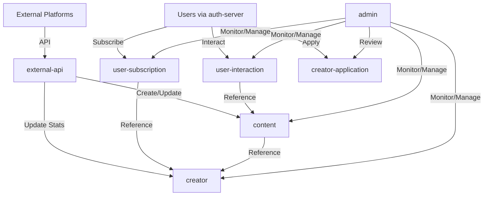

# my-pick-server 도메인 아키텍처

> 크리에이터/유튜버 팬들을 위한 통합 콘텐츠 허브 서비스의 도메인 구조 및 역할 정의

## 📋 목차

1. [아키텍처 개요](#아키텍처-개요)
2. [도메인 분류](#도메인-분류)
3. [핵심 도메인](#핵심-도메인)
4. [중간테이블 도메인](#중간테이블-도메인)
5. [지원 도메인](#지원-도메인)
6. [도메인 간 의존성 관계](#도메인-간-의존성-관계)
7. [아키텍처 설계 원칙](#아키텍처-설계-원칙)
8. [krgeobuk 표준 패턴 적용](#krgeobuk-표준-패턴-적용)

---

## 🏗️ 아키텍처 개요

my-pick-server는 **도메인 주도 설계(DDD)** 원칙을 기반으로 구성된 마이크로서비스입니다. 각 도메인은 명확한 책임과 역할을 가지며, **krgeobuk 생태계의 표준 패턴**을 준수하여 구현되었습니다.

### 핵심 특징
- **단일 책임 원칙**: 각 도메인이 하나의 명확한 비즈니스 영역을 담당
- **느슨한 결합**: 도메인 간 의존성을 최소화하여 독립적 개발 및 배포 가능
- **확장성**: 새로운 플랫폼이나 기능 추가 시 기존 코드에 미치는 영향 최소화
- **표준화**: krgeobuk 생태계의 일관된 개발 패턴 적용

---

## 🔄 도메인 분류

### 1. 핵심 도메인 (Single Domain Pattern)
비즈니스의 핵심 엔티티를 중심으로 하는 도메인들
- **creator**: 크리에이터 관리
- **content**: 콘텐츠 관리  
- **creator-application**: 크리에이터 신청 관리

### 2. 중간테이블 도메인 (Junction Table Pattern)
도메인 간 관계를 관리하는 도메인들
- **user-subscription**: 사용자-크리에이터 구독 관계
- **user-interaction**: 사용자-콘텐츠 상호작용

### 3. 지원 도메인 (Supporting Domain)
시스템 운영 및 확장을 지원하는 도메인들
- **admin**: 관리자 기능
- **external-api**: 외부 API 통합

---

## 🎯 핵심 도메인

### creator 도메인

#### 📝 역할 및 책임
- 크리에이터 프로필 정보 관리
- 플랫폼별 계정 연동 (YouTube, Twitter 등)
- 크리에이터 통계 및 메트릭 추적
- 크리에이터 검색 및 카테고리 분류

#### 🗄️ 주요 엔티티
```typescript
@Entity('creators')
export class CreatorEntity {
  id: string;                    // UUID 기본키
  name: string;                  // 실명
  displayName: string;           // 표시명
  avatar?: string;               // 프로필 이미지
  description?: string;          // 소개
  isVerified: boolean;           // 인증 여부
  followerCount: number;         // 총 팔로워 수
  contentCount: number;          // 콘텐츠 수
  totalViews: number;            // 총 조회수
  category: string;              // 카테고리
  tags?: string[];               // 태그
  platforms: CreatorPlatformEntity[]; // 플랫폼 계정들
}

@Entity('creator_platforms')
export class CreatorPlatformEntity {
  id: string;
  creatorId: string;
  type: 'youtube' | 'twitter' | 'instagram' | 'tiktok';
  platformId: string;            // 플랫폼별 고유 ID
  url: string;                   // 플랫폼 URL
  followerCount: number;         // 플랫폼별 팔로워 수
  isActive: boolean;             // 활성 상태
  lastSyncAt?: Date;             // 마지막 동기화 시간
  syncStatus: 'active' | 'error' | 'disabled';
}
```

#### ⚡ 핵심 기능
- **검색 및 조회**: 카테고리, 태그, 이름으로 크리에이터 검색
- **프로필 관리**: 크리에이터 정보 생성, 수정, 삭제
- **플랫폼 연동**: 여러 소셜 플랫폼 계정 연결 및 관리
- **통계 추적**: 팔로워 수, 콘텐츠 수, 조회수 등 메트릭 관리

#### 🌐 API 엔드포인트
```
GET    /api/v1/creators              # 크리에이터 목록 (검색, 필터링)
GET    /api/v1/creators/:id          # 크리에이터 상세 정보
POST   /api/v1/creators/:id/subscribe # 구독하기
DELETE /api/v1/creators/:id/subscribe # 구독 해제
GET    /api/v1/creators/:id/stats    # 크리에이터 통계
```

---

### content 도메인

#### 📝 역할 및 책임
- 모든 플랫폼의 콘텐츠 통합 관리
- 콘텐츠 메타데이터 및 통계 정보 저장
- 콘텐츠 검색 및 필터링 기능 제공
- 트렌딩 콘텐츠 및 개인화 피드 생성

#### 🗄️ 주요 엔티티
```typescript
@Entity('content')
export class ContentEntity {
  id: string;                    // UUID 기본키
  type: 'youtube_video' | 'twitter_post' | 'instagram_post';
  title: string;                 // 제목
  description?: string;          // 설명
  thumbnail: string;             // 썸네일 URL
  url: string;                   // 원본 URL
  platform: string;             // 플랫폼 (youtube, twitter 등)
  platformId: string;           // 플랫폼별 고유 ID
  duration?: number;             // 영상 길이 (초)
  publishedAt: Date;             // 게시 시간
  creatorId: string;             // 크리에이터 ID
  statistics: ContentStatisticsEntity; // 통계 정보
  metadata: {                    // 메타데이터
    tags: string[];
    category: string;
    language: string;
    isLive: boolean;
    quality: 'sd' | 'hd' | '4k';
    ageRestriction?: boolean;
  };
}

@Entity('content_statistics')
export class ContentStatisticsEntity {
  contentId: string;             // 콘텐츠 ID (기본키)
  views: number;                 // 조회수
  likes: number;                 // 좋아요 수
  comments: number;              // 댓글 수
  shares: number;                // 공유 수
  engagementRate: number;        // 참여율 (0-100%)
  updatedAt: Date;               // 마지막 업데이트
}
```

#### ⚡ 핵심 기능
- **콘텐츠 피드**: 개인화된 콘텐츠 목록 제공
- **검색 및 필터링**: 제목, 태그, 카테고리, 플랫폼별 검색
- **트렌딩 분석**: 인기 콘텐츠 및 급상승 콘텐츠 식별
- **통계 관리**: 실시간 조회수, 좋아요, 댓글 수 추적

#### 🌐 API 엔드포인트
```
GET    /api/v1/content                 # 콘텐츠 피드 (페이지네이션, 필터링)
GET    /api/v1/content/:id             # 콘텐츠 상세 정보
POST   /api/v1/content/:id/bookmark    # 북마크 추가
DELETE /api/v1/content/:id/bookmark    # 북마크 제거
POST   /api/v1/content/:id/like        # 좋아요
GET    /api/v1/content/bookmarks       # 사용자 북마크 목록
GET    /api/v1/content/trending        # 트렌딩 콘텐츠
```

---

### creator-application 도메인

#### 📝 역할 및 책임
- 크리에이터 가입 신청 프로세스 관리
- 신청서 검토 및 승인/거부 워크플로우
- 신청 상태 추적 및 알림
- 신청 요구사항 검증

#### 🗄️ 주요 엔티티
```typescript
@Entity('creator_applications')
export class CreatorApplicationEntity {
  id: string;                    // UUID 기본키
  userId: string;                // 신청자 ID (auth-server 관리)
  status: 'pending' | 'approved' | 'rejected';
  appliedAt: Date;               // 신청 일시
  reviewedAt?: Date;             // 검토 일시
  reviewerId?: string;           // 검토자 ID (관리자)
  applicationData: {             // 신청 데이터
    channelInfo: {
      platform: string;
      channelId: string;
      channelUrl: string;
    };
    subscriberCount: number;
    contentCategory: string;
    sampleVideos: Array<{
      title: string;
      url: string;
      views: number;
    }>;
    description: string;
  };
  reviewData?: {                 // 검토 결과
    reason?: string;
    comment?: string;
    requirements?: string[];
  };
}
```

#### ⚡ 핵심 기능
- **신청서 제출**: 크리에이터 등록 신청서 작성 및 제출
- **자격 검증**: 최소 구독자 수, 콘텐츠 품질 등 요구사항 확인
- **검토 워크플로우**: 관리자 검토, 승인/거부 처리
- **상태 추적**: 신청 진행 상태 실시간 업데이트

#### 🌐 API 엔드포인트
```
POST /api/v1/creator-application        # 크리에이터 신청
GET  /api/v1/creator-application/status # 신청 상태 조회
PUT  /api/v1/creator-application/:id    # 신청서 수정
```

---

## 🔗 중간테이블 도메인

### user-subscription 도메인

#### 📝 역할 및 책임
- 사용자와 크리에이터 간의 구독 관계 관리
- 구독 알림 설정 관리
- 구독자/구독 통계 제공
- 구독 기반 개인화 서비스 지원

#### 🗄️ 주요 엔티티
```typescript
@Entity('user_subscriptions')
export class UserSubscriptionEntity {
  userId: string;                // 사용자 ID (복합키)
  creatorId: string;             // 크리에이터 ID (복합키)
  notificationEnabled: boolean;   // 알림 활성화 여부
  subscribedAt: Date;            // 구독 시작 일시
  creator: CreatorEntity;        // 크리에이터 정보 (관계)
}
```

#### ⚡ 핵심 기능
- **구독 관리**: 크리에이터 구독/구독해제
- **구독 목록**: 사용자별 구독한 크리에이터 목록
- **구독자 목록**: 크리에이터별 구독자 목록
- **알림 설정**: 구독별 알림 활성화/비활성화

#### 🌐 API 엔드포인트
```
GET    /api/v1/users/:userId/subscriptions              # 사용자 구독 목록
GET    /api/v1/creators/:creatorId/subscribers          # 크리에이터 구독자 목록
GET    /api/v1/users/:userId/subscriptions/:creatorId/exists # 구독 여부 확인
POST   /api/v1/users/:userId/subscriptions/:creatorId   # 구독하기
DELETE /api/v1/users/:userId/subscriptions/:creatorId   # 구독 해제
PUT    /api/v1/users/:userId/subscriptions/:creatorId   # 알림 설정 변경
```

---

### user-interaction 도메인

#### 📝 역할 및 책임
- 사용자와 콘텐츠 간의 모든 상호작용 추적
- 개인화 추천을 위한 사용자 행동 데이터 수집
- 콘텐츠 참여도 분석
- 사용자 선호도 학습

#### 🗄️ 주요 엔티티
```typescript
@Entity('user_interactions')
export class UserInteractionEntity {
  userId: string;                // 사용자 ID (복합키)
  contentId: string;             // 콘텐츠 ID (복합키)
  isBookmarked: boolean;         // 북마크 여부
  isLiked: boolean;              // 좋아요 여부
  watchedAt?: Date;              // 시청 일시
  watchDuration?: number;        // 시청 시간 (초)
  rating?: number;               // 평점 (1-5)
}
```

#### ⚡ 핵심 기능
- **북마크 관리**: 콘텐츠 북마크 추가/제거
- **좋아요 관리**: 콘텐츠 좋아요/좋아요 취소
- **시청 기록**: 콘텐츠 시청 시간 및 진행률 추적
- **평점 시스템**: 사용자 콘텐츠 평가

#### 🌐 API 엔드포인트
```
POST   /api/v1/content/:id/bookmark    # 북마크 추가
DELETE /api/v1/content/:id/bookmark    # 북마크 제거
POST   /api/v1/content/:id/like        # 좋아요
DELETE /api/v1/content/:id/like        # 좋아요 취소
POST   /api/v1/content/:id/rating      # 평점 등록
GET    /api/v1/users/:userId/bookmarks # 사용자 북마크 목록
GET    /api/v1/users/:userId/history   # 사용자 시청 기록
```

---

## 🛠️ 지원 도메인

### admin 도메인

#### 📝 역할 및 책임
- 시스템 전반의 관리 및 모니터링
- 콘텐츠 모더레이션 및 사용자 관리
- 통계 및 분석 대시보드 제공
- 시스템 설정 및 정책 관리

#### 🏗️ 주요 컴포넌트
- **AdminDashboardService**: 시스템 통계 및 메트릭 수집
- **AdminContentController**: 콘텐츠 모더레이션
- **AdminUserController**: 사용자 관리 및 제재

#### ⚡ 핵심 기능
- **대시보드**: 실시간 시스템 현황 및 통계
- **콘텐츠 모더레이션**: 부적절한 콘텐츠 검토 및 조치
- **사용자 관리**: 사용자 상태 관리, 제재, 활동 모니터링
- **크리에이터 신청 관리**: 신청서 검토 및 승인/거부

#### 🌐 API 엔드포인트
```
GET  /api/v1/admin/dashboard                    # 관리자 대시보드
GET  /api/v1/admin/dashboard/stats              # 시스템 통계
GET  /api/v1/admin/dashboard/metrics            # 상세 메트릭

GET  /api/v1/admin/content                      # 콘텐츠 관리 목록
GET  /api/v1/admin/content/:id                  # 콘텐츠 상세 관리
PUT  /api/v1/admin/content/:id/status           # 콘텐츠 상태 변경
DELETE /api/v1/admin/content/:id                # 콘텐츠 삭제

GET  /api/v1/admin/users                        # 사용자 관리 목록  
GET  /api/v1/admin/users/:id                    # 사용자 상세 관리
PUT  /api/v1/admin/users/:id/status             # 사용자 상태 변경
GET  /api/v1/admin/users/:id/activity           # 사용자 활동 내역

GET  /api/v1/admin/creator-applications         # 크리에이터 신청 목록
POST /api/v1/admin/creator-applications/:id/approve # 신청 승인
POST /api/v1/admin/creator-applications/:id/reject  # 신청 거부
```

---

### external-api 도메인

#### 📝 역할 및 책임
- 외부 플랫폼 API와의 통합 및 데이터 동기화
- API 레이트 리미팅 및 에러 처리
- 자동화된 콘텐츠 수집 스케줄링
- 플랫폼별 데이터 변환 및 정규화

#### 🏗️ 주요 컴포넌트
- **YouTubeApiService**: YouTube Data API v3 연동
- **TwitterApiService**: Twitter API v2 연동  
- **ExternalApiSchedulerService**: 자동 동기화 스케줄러

#### ⚡ 핵심 기능
- **YouTube 연동**: 채널 정보, 비디오 목록, 통계 수집
- **Twitter 연동**: 사용자 정보, 트윗 목록, 메트릭 수집
- **자동 동기화**: 주기적 콘텐츠 업데이트 (YouTube 1시간, Twitter 30분)
- **데이터 변환**: 외부 API 응답을 내부 엔티티로 변환

#### 🕐 동기화 스케줄
```
@Cron(CronExpression.EVERY_HOUR)     // YouTube 동기화
@Cron(CronExpression.EVERY_30_MINUTES) // Twitter 동기화
```

#### 🔧 서비스별 기능

**YouTube API Service**:
- 채널 정보 조회 (구독자 수, 설명, 썸네일)
- 채널별 비디오 목록 수집
- 비디오 상세 정보 (통계, 메타데이터)
- 검색 기능

**Twitter API Service**:
- 사용자 프로필 정보 조회
- 사용자별 트윗 목록 수집
- 트윗 상세 정보 (메트릭, 미디어)
- 트윗 검색 기능

---

## 🔄 도메인 간 의존성 관계

### 의존성 다이어그램
```
┌─────────────┐    ┌─────────────┐    ┌─────────────┐
│    admin    │────│   creator   │────│   content   │
│             │    │             │    │             │
└─────────────┘    └─────────────┘    └─────────────┘
       │                   │                   │
       │                   │                   │
       ▼                   ▼                   ▼
┌─────────────┐    ┌─────────────┐    ┌─────────────┐
│user-        │    │user-        │    │external-api │
│subscription │    │interaction  │    │             │
│             │    │             │    │             │
└─────────────┘    └─────────────┘    └─────────────┘
       │                   │                   │
       │                   │                   │
       └─────────┬─────────┘                   │
                 │                             │
                 ▼                             │
       ┌─────────────┐                        │
       │creator-     │◄───────────────────────┘
       │application  │
       │             │
       └─────────────┘
```

### 의존성 흐름
1. **admin** → creator, content, user-subscription, user-interaction, creator-application
2. **external-api** → creator, content  
3. **content** → creator (creatorId 참조)
4. **user-subscription** → creator (creatorId 참조)
5. **user-interaction** → content (contentId 참조)
6. **creator-application** → 독립적 (auth-server와만 연동)

### 데이터 흐름


---

## 🎯 아키텍처 설계 원칙

### 1. 단일 책임 원칙 (Single Responsibility Principle)
- 각 도메인이 명확한 하나의 비즈니스 영역을 담당
- 도메인 내 변경 사유가 단일함
- 응집도 높고 결합도 낮은 설계

### 2. 확장성 (Scalability)
- **플랫폼 확장**: 새로운 소셜 플랫폼 추가 시 external-api 도메인만 확장
- **기능 확장**: 새로운 상호작용 타입 추가 시 user-interaction 도메인만 수정
- **서비스 확장**: 각 도메인을 독립적인 마이크로서비스로 분리 가능

### 3. 테스트 용이성 (Testability)
- **격리된 테스트**: 각 도메인별 독립적인 단위 테스트
- **Mock 의존성**: 외부 서비스 의존성을 Mock으로 대체 가능
- **통합 테스트**: 도메인 간 상호작용 검증

### 4. 유지보수성 (Maintainability)
- **명확한 경계**: 도메인별 코드 변경이 다른 도메인에 미치는 영향 최소화
- **표준 패턴**: krgeobuk 표준 적용으로 일관된 코드 구조
- **문서화**: 각 도메인의 역할과 책임이 명확히 정의됨

### 5. 성능 최적화
- **캐싱 전략**: 자주 조회되는 데이터는 Redis 캐싱
- **인덱싱**: 검색 성능 최적화를 위한 데이터베이스 인덱스
- **페이지네이션**: 대용량 데이터 처리를 위한 커서 기반 페이지네이션

---

## 🔧 krgeobuk 표준 패턴 적용

### 서비스 클래스 구조
모든 도메인에서 일관된 서비스 구조 적용:

```typescript
@Injectable()
export class DomainService {
  private readonly logger = new Logger(DomainService.name);

  // ==================== PUBLIC METHODS ====================
  // 기본 조회: findById, findByIdOrFail, findByIds
  // 복합 조회: search*, get*
  
  // ==================== 변경 메서드 ====================  
  // create*, update*, delete*
  
  // ==================== PRIVATE HELPER METHODS ====================
  // 헬퍼 메서드들
}
```

### API 설계 표준
- **단일 도메인**: `/api/v1/{domain}s` 패턴
- **중간테이블**: `/api/v1/{entityA}s/:idA/{entityB}s/:idB` 패턴
- **관리자**: `/api/v1/admin/{domain}s` 패턴

### 에러 처리 표준
- 도메인별 Exception 클래스
- 구조화된 에러 코드 체계
- 일관된 에러 응답 형식

### TCP 통신 표준
- 표준 메시지 패턴: `{domain}.{operation}`
- 적절한 로그 레벨 적용
- 타임아웃 및 재시도 로직

---

## 📈 향후 확장 계획

### 1. 알림 시스템 (notification 도메인)
- 실시간 알림 처리
- WebSocket 기반 푸시 알림
- 알림 설정 관리

### 2. 추천 시스템 (recommendation 도메인)  
- ML 기반 개인화 추천
- 협업 필터링
- 콘텐츠 기반 필터링

### 3. 분석 시스템 (analytics 도메인)
- 사용자 행동 분석
- 비즈니스 인텔리전스
- 실시간 대시보드

### 4. 새로운 플랫폼 지원
- Instagram API 연동
- TikTok API 연동
- Twitch API 연동

---

## 🏁 결론

my-pick-server의 도메인 아키텍처는 **명확한 책임 분리**, **확장 가능한 설계**, **표준화된 패턴**을 통해 크리에이터 콘텐츠 플랫폼의 복잡한 요구사항을 체계적으로 관리합니다.

각 도메인은 독립적으로 개발, 테스트, 배포가 가능하며, krgeobuk 생태계의 일관된 품질 기준을 유지합니다. 이러한 설계를 통해 빠른 기능 개발과 안정적인 서비스 운영이 가능합니다.

---

*문서 작성일: 2024년 7월*  
*버전: 1.0*  
*작성자: Claude Code (Anthropic)*